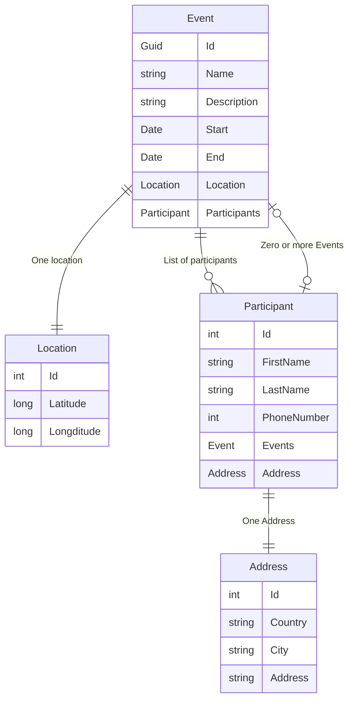

# Model overview

```mermaid
erDiagram
    Event {
        Guid Id
        string Name 
        string Description
        Date Start
        Date End
        Location Location
        Participant Participants
    }
    Event ||--|| Location : "One location"
    Event ||--o{ Participant : "List of participants"
    Participant {
        int Id
        string FirstName
        string LastName
        int PhoneNumber
        Event Events
        Address Address
    }
    Participant ||--|| Address : "One Address"
    Participant |o--o| Event : "Zero or more Events"
    Location {
        int Id
        long Latitude
        long Longditude
    }
    Address {
        int Id
        string Country
        string City
        string Address
    }
```